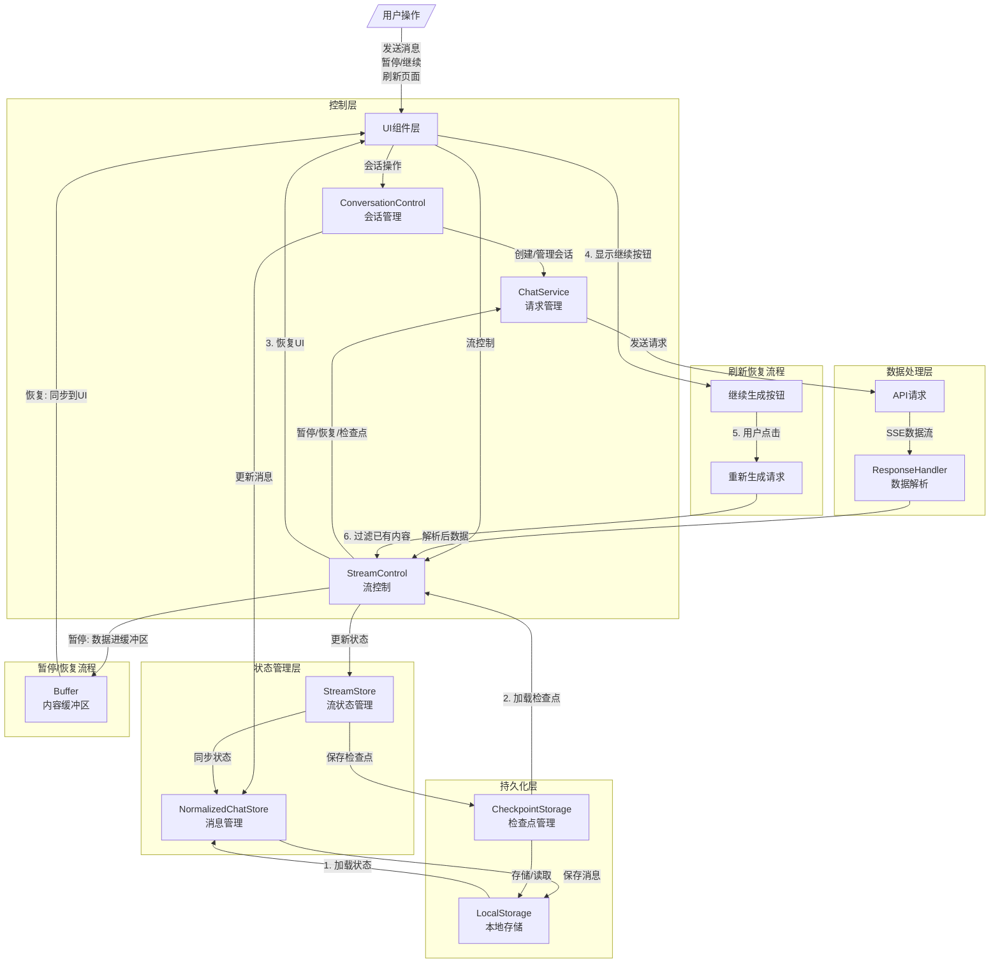

# 流控制架构 2.0

一个现代化的流式生成控制架构，专为大型语言模型的流式响应设计，提供强大的状态管理、缓冲区控制和检查点功能。

## 核心特性

- **完整的流生命周期管理**：从创建到暂停、恢复、完成的全流程控制
- **事件系统**：基于事件的架构，支持组件间松耦合通信
- **检查点系统**：支持流生成过程中的状态保存和恢复
- **缓冲区管理**：在暂停状态下智能缓冲新内容，避免UI闪烁
- **页面刷新恢复**：支持页面刷新后恢复生成状态
- **清晰的职责分离**：各组件职责明确，易于维护和扩展

## 架构组件

### 核心组件

1. **StreamControl**：流控制器，负责流的生命周期管理
2. **StreamStore**：流状态存储，负责状态管理和持久化
3. **CheckpointStorage**：检查点存储，负责状态保存和恢复
4. **ConversationControl**：会话控制器，负责会话和消息管理

### 辅助组件

1. **ResponseHandler**：响应处理器，负责解析和处理API响应
2. **ChatService**：聊天服务，负责API请求管理

## 使用指南

### 基本使用

```typescript
// 1. 创建流控制器
const streamControl = useNewStreamControl({
  checkpointInterval: 5000, // 自动创建检查点间隔（毫秒）
  clearOnUnmount: false     // 组件卸载时是否清除状态
})

// 2. 创建会话控制器
const conversationControl = useNewConversationControl({
  streamControl: createStreamControlContext(streamControl),
  clearOnUnmount: false
})

// 3. 发送消息
await conversationControl.messageActions.send("你好，请介绍一下自己")

// 4. 流控制
// 暂停生成
streamControl.pauseStream()
// 恢复生成
streamControl.resumeStream()
// 中止生成
streamControl.abortStream()
```

### 事件监听

```typescript
// 监听流事件
streamControl.on(StreamEvent.PAUSE, (payload) => {
  console.log(`流已暂停: ${payload.messageId}`)
})

// 监听会话事件
conversationControl.on(ConversationEvent.MESSAGE_ADDED, (payload) => {
  console.log(`新消息: ${payload.role} - ${payload.content}`)
})
```

### 检查点管理

```typescript
// 创建检查点
streamControl.createCheckpoint()

// 从检查点恢复
streamControl.restoreFromCheckpoint()
```

## 架构流程图



## 设计理念

1. **职责分离**：每个组件有明确的单一职责，降低耦合度
2. **事件驱动**：基于事件的通信机制，提高系统灵活性
3. **状态管理**：统一的状态管理，确保数据一致性
4. **持久化**：完善的状态持久化机制，支持页面刷新恢复
5. **用户体验**：缓冲区管理和检查点系统，提供流畅的用户体验

## 与旧版本的区别

1. **流控制与会话控制解耦**：明确分离流控制和会话管理职责
2. **增强的事件系统**：提供完整的事件通知机制
3. **检查点系统**：新增检查点功能，支持状态保存和恢复
4. **缓冲区管理**：优化暂停/恢复体验，避免内容闪烁
5. **类型安全**：完整的TypeScript类型定义，提高代码质量 